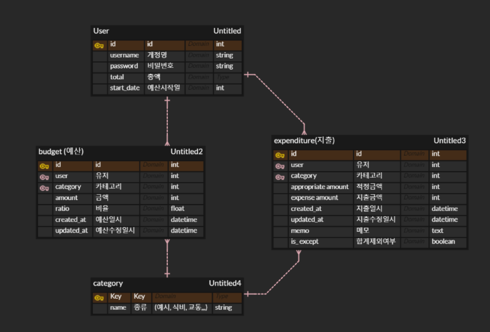
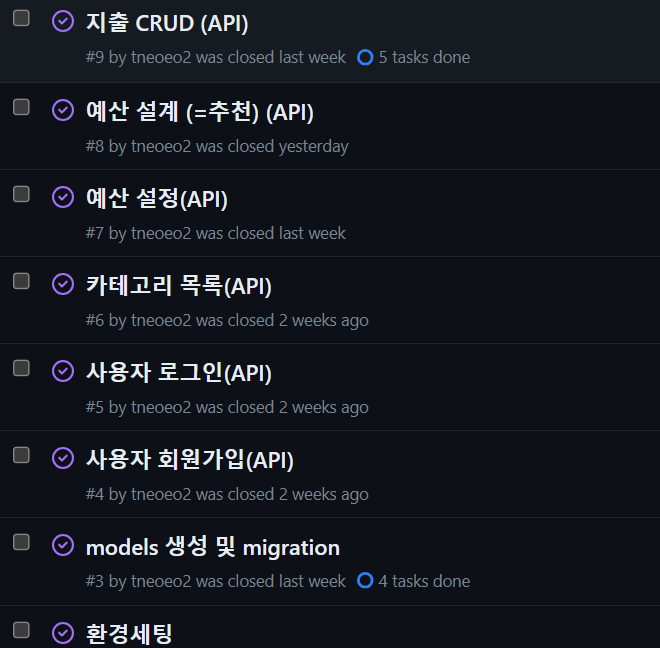

# 💸예산 관리 어플리케이션

## 개요
사용자들이 개인 재무를 관리하고 지출을 추적하는데 도움을 주는 애플리케이션입니다. 
<br>사용자들이 예산을 설정하고 지출을 모니터링하며 재무 목표를 달성하는데 도움이 됩니다.

## 개발환경세팅
- 가상환경 : 
- 언어 및 프레임 워크 : 
- 데이터베이스 : 

## Installation
```
poetry install
```

## ER-Diagram



## API Reference
<details> <summary>사용자 회원가입 API</summary>
<div markdown="1">

```plain
 POST /api/auth/signup/ 
```

#### Request
```
{
  "username": "testuser",
  "password": "testpassword"
}
```

#### Response
```
{
  "access_token": "eyJhbGc..."
}
```

</div> </details>

<details> <summary>사용자 로그인 API</summary>
<div markdown="1">

```plain
 POST /api/auth/jwt-login/ 
```

#### Request
```
{
  "username": "testuser",
  "password": "testpassword"
}
```

#### Response
```

{
    "refresh": "eyJh..",
    "access": "eyJhb.."
}
```
</div> </details>

<details> <summary>카테고리 목록 API</summary>
<div markdown="1">

```plain
 GET /api/budgets/category/
```

#### Response
```
{
    "status": "success",
    "data": [
        {
            "id": 1,
            "name": "식비"
        },
        {
            "id": 2,
            "name": "교통"
        },
        {
            "id": 3,
            "name": "건강"
        },
        {
            "id": 4,
            "name": "문화생활"
        }
    ]
}
```
</div> </details>

<details> <summary>예산 설정 API</summary>
<div markdown="1">

```plain
 POST /api/budgets/
 PATCH /api/budgets/
```

#### Request
```
{
    'category' : 1,
    'amount' : 10000
}
```

#### Response
```
{
    "category": 4,
    "amount": 30000,
    "user": 1,
    "ratio": "0.00"
}
```
</div> </details>

<details> <summary>예산 설계(추천) API</summary>
<div markdown="1">

```plain
GET /api/budgets/rec
```

#### Response
```
[
    {
        "category": 2,
        "amount": 20000,
        "user": 2,
        "ratio": "0.00"
    },
    {
        "category": 1,
        "amount": 30000,
        "user": 2,
        "ratio": "0.00"
    },
    {
        "category": 1,
        "amount": 35000,
        "user": 1,
        "ratio": "1.17"
    },
   ...
]
```
</div> </details>

<details> <summary>지출 CRUD API</summary>
<div markdown="1">

```plain
 GET /api/expenditures/
```

#### Response
```
{
    "data_list": [
        {
            "id": 1,
            "user_id": 1,
            "category_id": 1,
            "appropriate_amount_id": 1,
            "expense_amount": 100,
            "create_at": "2023-11-14T15:00:00Z",
            "updated_at": "2023-11-15T15:00:00Z",
            "memo": "test",
            "is_except": false,
            "month": 11,
            "total_expense": 100
        }
    ],
    "category_summary": [
        {
            "category": 1,
            "month": 11,
            "total_expense": 100
        }
    ],
    "total_expenditures": 100
}
```

---

```plain
 PUT /api/expenditures/<id>/
```
#### Request
```
{
    'category' : 1,
    'expense_amount' : 10000,
    'memo' : '뭐라고 해야할까..',
    'amount' : 10000,
    'is_except' : true,
}
```

#### Response
```
{
    "category": 1,
    "expense_amount": 30000,
    "memo": "뭐라고 해야할까..",
    "is_except": true,
    "total": 100
}
```
---
```plain
 PATCH /api/expenditures/<id>/
```
#### Request
```
{
    'is_except' : false,
}
```

#### Response
```
{
    "category": 1,
    "expense_amount": 30000,
    "memo": "뭐라고 해야할까..",
    "is_except": false,
    "total": 100
}
```
---

```plain
 DELETE /api/expenditures/<id>/
```


</div> </details>

<details> <summary>오늘 지출 추천 API</summary>
<div markdown="1">

```plain
 GET /api/expenditures/rec/
```

#### Response
```
{
    "month_budgets": 102500,
    "daily_budget": 3416.6666666666665,
    "by_category_rec": {}
}
```

</div> </details>

<details> <summary>오늘 안내 API</summary>
<div markdown="1">  

```plain
 GET /api/expenditures/noti/
```

#### Response
```
{
    "total": [
        {
            "date": "2023-11-30",
            "total_expense": 100
        }
    ],
    "by_category": [
        {
            "category": 1,
            "date": "2023-11-30",
            "total_expense": 100
        }
    ],
    "monthly_statistics ": {
        "appropriate_expenditure": 1,
        "today_expenditure": [
            {
                "date": "2023-11-30",
                "total_expense": 100
            }
        ],
        "caution": 1.0
    }
}
```
</div> </details>


## 프로젝트 진행 및 이슈관리
Github의 ISSUE 및 Project기능을 이용하여 관리



